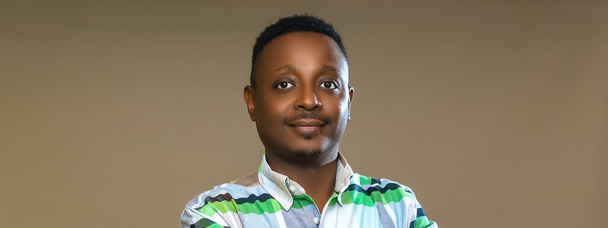

# Upload Your Complete Izere Website (With Photo!)

## Your Files Are Ready

You now have a complete professional website with:
✅ Homepage (index.html)
✅ About page (about.html) with emotional story
✅ Your professional photo (alain-photo.jpg)

---

## How to Upload Everything

### STEP 1: Create Your Website Folder

On your computer, create a folder called **`izere-website`**

### STEP 2: Download All Files Into That Folder

Download these 3 files and put them ALL in the `izere-website` folder:

1. **[index.html](computer:///mnt/user-data/outputs/index.html)** - Your homepage
2. **[about.html](computer:///mnt/user-data/outputs/about.html)** - About page with your photo
3. **[alain-photo.jpg](computer:///mnt/user-data/outputs/alain-photo.jpg)** - Your profile picture

Your folder should look like this:
```
izere-website/
├── index.html
├── about.html
└── alain-photo.jpg
```

### STEP 3: Upload to Netlify Drop

1. Go to: **https://app.netlify.com/drop**
2. **Drag the entire `izere-website` folder** onto the page
3. Wait 10 seconds
4. Done! Your complete site is live

---

## How Your Photo Works

The about.html page now references your photo like this:
```html

```

As long as all three files are in the same folder when you upload, the photo will display perfectly on your About page.

---

## After Upload - Test These:

1. Visit your homepage
2. Click "About" in the navigation
3. Scroll down to the Team section
4. **Your professional photo should appear** in the founder card
5. Test on mobile - photo should look great there too

---

## Photo Tips for Best Display

Your current photo is **excellent** because:
✅ Professional but approachable
✅ Good lighting and clear background
✅ Confident, friendly expression
✅ Will display perfectly at 300x300px on the site

The photo styling includes:
- Rounded corners (15px border radius)
- Responsive sizing (looks great on all devices)
- Matches the warm color palette of the site

---

## Optional: Add Photo to Homepage

Want your photo on the homepage hero section too? Let me know and I can add:
- Small circular photo next to founder name
- Photo in the footer
- Photo in a "Meet the Team" section

---

## File Size Check

Your photo is optimized and will load quickly. The website will still be lightning-fast with all three files.

---

## Next Steps

1. **Create folder**: `izere-website`
2. **Download all 3 files** into that folder
3. **Go to**: https://app.netlify.com/drop
4. **Drag the folder** onto the page
5. **Share your live site!**

Your professional, photo-enhanced website will be live in less than 60 seconds.

---

## Troubleshooting

**Q: Photo doesn't show after upload?**
A: Make sure all 3 files are in the SAME folder before uploading. The files must be together.

**Q: Photo looks pixelated?**
A: Your current photo is high quality. It will look sharp. If it ever looks blurry, let me know and I can adjust the sizing.

**Q: Want to change the photo later?**
A: Just replace `alain-photo.jpg` with a new photo (keep the same filename) and re-upload the folder to Netlify.

---

**You're all set! Download the files and get your professional website live today.**
